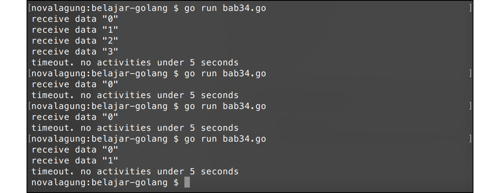

# Channel - Timeout

Timeout digunakan untuk mengontrol penerimaan data dari channel berdasarkan waktu diterimanya, dengan durasi timeout bisa ditentukan sendiri. 

Ketika tidak ada aktivitas penerimaan data selama durasi tersebut, akan memicu callback yang isinya juga ditentukan sendiri.

## Penerapan Channel Timeout

Berikut adalah program sederhana tentang pengaplikasian timeout pada channel. Sebuah goroutine baru dijalankan dengan tugas mengirimkan data setiap interval tertentu, dengan durasi interval-nya adalah acak/random.

```go
import "fmt"
import "math/rand"
import "runtime"
import "time"

func sendData(ch chan<- int) {
    for i := 0; true; i++ {
        ch <- i
        time.Sleep(time.Duration(rand.Int()%10+1) * time.Second)
    }
}
```

Selanjutnya, disiapkan perulangan tanpa henti, yang di tiap perulangannya ada seleksi kondisi channel menggunakan `select`.

```go
func retreiveData(ch <-chan int) {
    loop:
    for {
        select {
        case data := <-ch:
            fmt.Print(`receive data "`, data, `"`, "\n")
        case <-time.After(time.Second * 5):
            fmt.Println("timeout. no activities under 5 seconds")
            break loop
        }
    }
}
```

Ada 2 blok kondisi pada `select` tersebut.

 - `case data := <-messages:`, akan terpenuhi ketika ada serah terima data pada channel `messages`
 - `case <-time.After(time.Second * 5):`, akan terpenuhi ketika tidak ada aktivitas penerimaan data dari channel dalam durasi 5 detik.

Terakhir, kedua fungsi tersebut dipanggil di `main`.

```go
func main() {
    rand.Seed(time.Now().Unix())
    runtime.GOMAXPROCS(2)

    var messages = make(chan int)

    go sendData(messages)
    retreiveData(messages)
}
```

Akan muncul output setiap kali ada penerimaan data dengan delay waktu acak. Ketika tidak ada aktifitas pada channel dalam durasi 5 detik, perulangan pengecekkan channel akan dihentikan.


