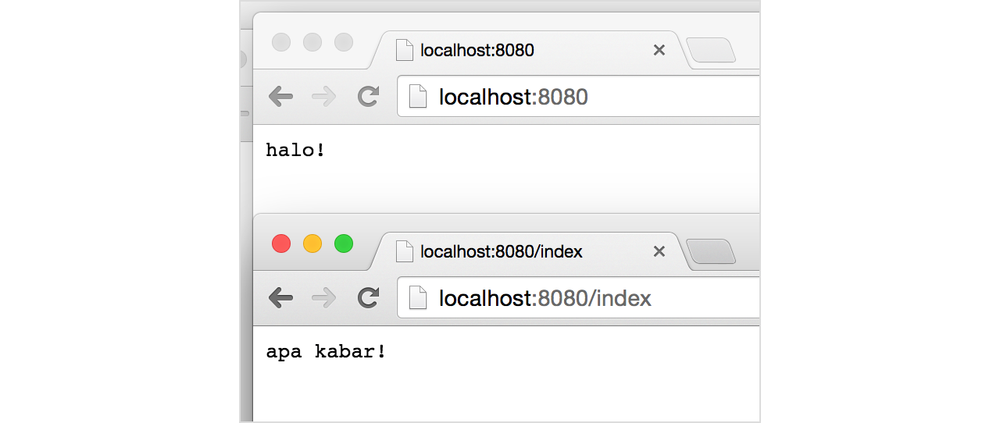

# Web

Golang menyediakan package `net/http` yang berisikan berbagai macam fitur untuk keperluan pembuatan aplikasi berbasi web. Termasuk didalamnya routing, server, templating, dan lainnya, semua tinggal pakai.

Golang memiliki web server sendiri, dan web server tersebut berada di dalam golang, tdak seperti bahasa lain yang server nya terpisah dan perlu di-instal sendiri (seperti PHP yang memerlukan Apache, .NET yang memerlukan IIS). Tapi tak menutup kemungkinan juga untuk menjalankan apliakasi Golang pada web server lain seperti server Nginx.

Di bab ini kita akan belajar cara pembuatan aplikasi web sederhanda, dan juga pemanfaatan template dalam mendesain view.

## Membuat Aplikasi Web Sederhanda

Package `net/http` memiliki banyak sekali fungsi yang bisa dimanfaatkan. Di bagian ini kita akan mempelajari beberapa fungsi penting seperti *routing* dan *start server*.

Program dibawah ini merupakan contoh sederhana untuk memunculkan text di web ketika url tertentu diakses.

```go
import "fmt"
import "net/http"

func index(w http.ResponseWriter, r *http.Request) {
    fmt.Fprintln(w, "apa kabar!")
}

func main() {
    http.HandleFunc("/", func(w http.ResponseWriter, r *http.Request) {
        fmt.Fprintln(w, "halo!")
    })

    http.HandleFunc("/index", index)

    fmt.Println("starting web server at http://localhost:8080/")
    http.ListenAndServe(":8080", nil)
}
```

Jalankan program tersebut.


Jika muncul dialog **Do you want the application “bab48” to accept incoming network connections?** atau sejenis, pilih allow. Lalu buka [http://localhost/](http://localhost/) dan [http://localhost/index](http://localhost/index/).



Fungsi `http.HandleFunc` digunakan untuk routing aplikasi web. Maksud dari routing adalah penentuan aksi ketika url tertentu diakses oleh user.

Pada kode di atas 2 rute didaftarkan, yaitu `/` dan `/index`. Aksi dari rute `/` adalah menampilkan text `"halo"` di halaman website. Sedangkan `/index` menampilkan text `"apa kabar!"`.

Fungsi `http.HandleFunc` memiliki 2 buah parameter yang harus diisi. Parameter pertama adalah rute yang diinginkan. Parameter kedua adalah *callback* atau aksi ketika rute tersebut diakses. Callback tersebut bertipe fungsi `func(w http.ResponseWriter, r *http.Request)`.

Pada pendaftaran rute `/index`, callback-nya adalah fungsi `index()`, hal seperti ini diperbolehkan asalkan tipe dari fungsi tersebut sesuai.

Fungsi `http.listenAndServe` digunakan untuk menghidupkan server sekaligus menjalankan aplikasi menggunakan server tersebut. Di golang, 1 web aplikasi adalah 1 buah server berbeda.

Pada contoh di atas, server dijalankan pada port `8080`.

Perlu diingat, setiap ada perubahan pada file, `go run` harus dipanggil lagi.

Untuk menghentikan web server, tekan **CTRL+C** pada terminal atau CMD dimana pengeksekusian aplikasi barlangsung.

## Penggunaan Template Web

Template memberikan kemudahan dalam mendesain tampilan view aplikasi website. Dan kabar baiknya golang menyediakan engine template sendiri, dengan banyak fitur yang tersedia didalamnya.

Di sini kita akan belajar contoh sederhana penggunaan template untuk menampilkan data.

Pertama siapkan dahulu template nya. Buat file `template.html` lalu isi dengan:

```html
<html>
    <head>
        <title>Golang learn net/http</title>
    </head>
    <body>
        <p>Hello {{.Name}} !</p>
        <p>{{.Message}}</p>
    </body>
</html>
```

`{{.Name}}` maksudnya adalah variabel bernama `Name`, yang nantinya akan di-replace dengan data dari back end.

Selanjutnya ubah isi file `.go` dengan kode berikut.

```go
package main

import "fmt"
import "html/template"
import "net/http"

func main() {
    http.HandleFunc("/", func(w http.ResponseWriter, r *http.Request) {
        var data = map[string]string{
            "Name":    "john wick",
            "Message": "have a nice day",
        }

        var t, err = template.ParseFiles("template.html")
        if err != nil {
            fmt.Println(err.Error())
        }

        t.Execute(w, data)
    })

    fmt.Println("starting web server at http://localhost:8080/")
    http.ListenAndServe(":8080", nil)
}
```

Jalankan, buka `http://localhost:8080/`, maka data `Nama` dan `Message` akan muncul di view.


Fungsi `template.ParseFiles` digunakan untuk parsing template, mengembalikan 2 data yaitu *instance* template-nya dan error (jika ada). Method `Execute()` milik template digunakan untuk menampilkan hasil parsing template ke layar web browser, dengan disisipkan data apa saja yang ingin ditampilkan.
