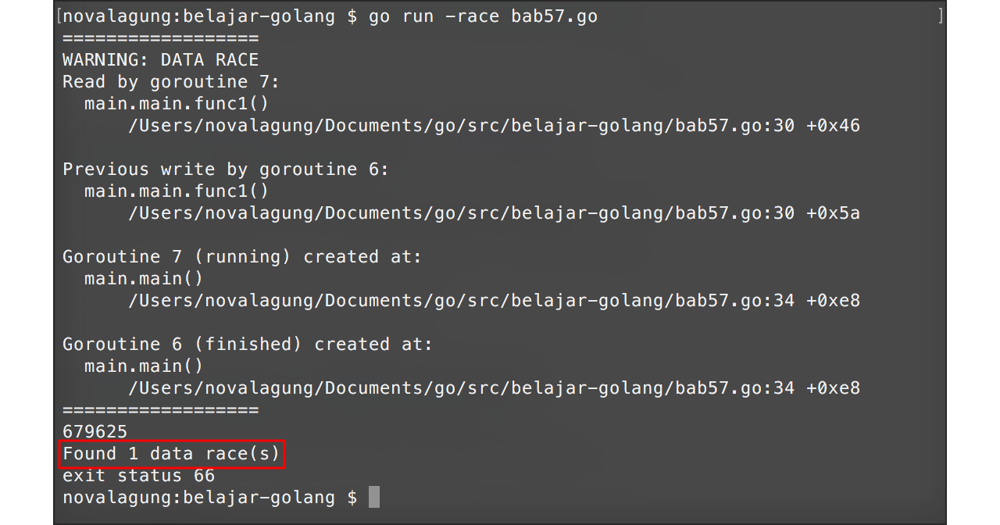

# Mutex

Sebelum kita membahas mengenai apa itu **mutex**? ada baiknya untuk mempelajari terlebih dahulu apa itu **race condition**, karena kedua konsep ini sangat erat hubungannya satu sama lain.

Race condition adalah kondisi dimana lebih dari 1 thread (dalam konteks ini, goroutine), mengakses data yang sama pada waktu yang bersamaan (benar-benar bersamaan). Ketika hal ini terjadi, nilai data tersebut akan menjadi kacau. Dalam **concurrency programming** situasi seperti ini ini sering terjadi.

Mutex adalah pengubahan level akses sebuah data menjadi eksklusif, menjadikan data tersebut hanya dapat dikonsumsi (read / write) oleh satu buah goroutine saja. Ketika terjadi race condition, maka hanya goroutine yang beruntung saja yang bisa mengakses data tersebut. Goroutine lain (yang waktu running nya kebetulan bersamaan) akan dipaksa untuk menunggu, hingga goroutine yang sedang memanfaatkan data tersebut selesai.

Golang menyediakan `sync.Mutex` yang bisa dimanfaatkan untuk keperluan **lock** dan **unlock** data.

Pada bab ini kita akan membahas mengenai race condition, dan cara untuk menanggulanginya menggunakan teknik mutex.

### Persiapan

Pertama siapkan struct baru bernama `counter`, dengan isi sebuah property `val` bertipe `int`. Property ini nantinya akan dikonsumsi dan diolah oleh banyak goroutine.

Selain itu struct ini juga memiliki beberapa method:

 1. Method `Add()` untuk increment nilai
 2. Method `Value()` untuk mengembalikan nilai 

Jangan lupa juga untuk meng-import package yang dibutuhkan.

```go
package main

import (
    "fmt"
    "runtime"
    "sync"
)

type counter struct {
    val int
}

func (c *counter) Add(x int) {
    c.val++
}

func (c *counter) Value() (x int) {
    return c.val
}
```

Kode di atas akan kita gunakan sebagai template contoh source code yang ada pada bab ini.

### Contoh Race Condition

Program berikut merupakan contoh program yang didalamnya memungkinkan terjadi race condition atau kondisi goroutine balapan.

> Pastikan jumlah core prosesor komputer anda adalah lebih dari satu. Karena contoh pada bab ini hanya akan berjalan sesuai harapan jika `GOMAXPROCS` > 1.

```go
func main() {
    runtime.GOMAXPROCS(2)

    var wg sync.WaitGroup
    var meter counter

    for i := 0; i < 1000; i++ {
        wg.Add(1)

        go func() {
            for j := 0; j < 1000; j++ {
                meter.Add(1)
            }

            wg.Done()
        }()
    }

    wg.Wait()
    fmt.Println(meter.Value())
}
```

Pada kode diatas, disiapkan sebuah instance `sync.WaitGroup` bernama `wg`, dan variabel object `meter` bertipe `counter` (nilai property `val` default-nya adalah **0**).

Setelahnya dijalankan perulangan sebanyak 1000 kali, yang ditiap perulanganya dijalankan sebuah goroutine baru. Didalam goroutine tersebut, terdapat perulangan lagi, sebanyak 1000 kali. Dalam perulangan tersebut nilai property `val` dinaikkan sebanyak 1 lewat method `Add()`.

Dengan demikian, ekspektasi nilai akhir `meter.val` harusnya adalah 1000000.

Di akhir, `wg.Wait()` dipanggil, dan nilai variabel counter `meter` diambil lewat `meter.Value()` untuk kemudian ditampilkan. Hasilnya bisa dilihat pada gambar berikut.


Nilai `meter.val` tidak genap 1000000? kenapa bisa begitu? Padahal seharusnya tidak ada masalah dalam kode yang kita tulis di atas.

Inilah yang disebut dengan race condition, kasus seperti ini memang hanya terjadi dalam **concurrency programming**.

### Deteksi Race Condition Menggunakan Golang Race Detector

Golang menyediakan fitur untuk [deteksi sebuah race condition](http://blog.golang.org/race-detector). Cara penggunaannya adalah dengan menambahkan flag `-race` pada saat eksekusi aplikasi.



Terlihat pada gambar diatas ada pesan bahwa terdapat sebuah data yang dijadikan bahan balapan oleh goroutine (`Found 1 data race(s)`).

### Penggunaan `sync.Mutex`

Sekarang kita tahu bahwa program di atas menghasilkan bug race condition. Untuk mengatasi masalah tersebut ada beberapa cara yang bisa digunakan, dan disini kita akan menggunakan `sync.Mutex`.

Ubah kode di atas, tambahkan property baru pada struct `counter`, yaitu `mu` dengan tipe `sync.Mutex`. Variabel ini akan kita gunakan untuk lock dan unlock data `c.val` pada saat pengaksesan lewat method `Add()` dan `Value()`.

```go
type counter struct {
    mu  sync.Mutex
    val int
}

func (c *counter) Add(x int) {
    c.mu.Lock()
    c.val++
    c.mu.Unlock()
}

func (c *counter) Value() (x int) {
    c.mu.Lock()
    var val = c.val
    c.mu.Unlock()

    return val
}
```

Method `Lock()` digunakan untuk menandai bahwa semua operasi pada baris setelah kode tersebut adalah bersifat eksklusif. Hanya ada satu buah goroutine yang bisa melakukannya dalam satu waktu. Jika ada banyak goroutine yang eksekusinya bersamaan, harus antri.

Pada kode di atas terdapat kode untuk increment nilai `meter.val`. Maka property tersebut hanya bisa diakses oleh satu goroutine saja.

Method `Unlock()` akan membuka kembali akses operasi ke property/variabel yang di lock. Bisa dibilang, proses mutual exclusion terjadi diantara kedua method tersebut, `Lock()` dan `Unlock()`.

Tak hanya ketika pengubahan nilai, pada saat pengaksesan juga perlu ditambahkan kedua fungsi ini, agar data yang diambil benar-benar data pada waktu itu.


<!-- https://en.wikipedia.org/wiki/Race_condition
http://blog.golang.org/race-detector
http://www.goinggo.net/2013/09/detecting-race-conditions-with-go.html
http://www.alexedwards.net/blog/understanding-mutexes
http://wysocki.in/golang-concurrency-data-races/
http://stackoverflow.com/questions/34510/what-is-a-race-condition
http://stackoverflow.com/questions/26521587/golang-how-to-share-value-message-or-mutex -->