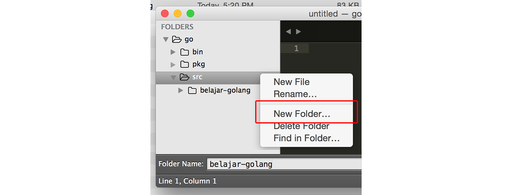
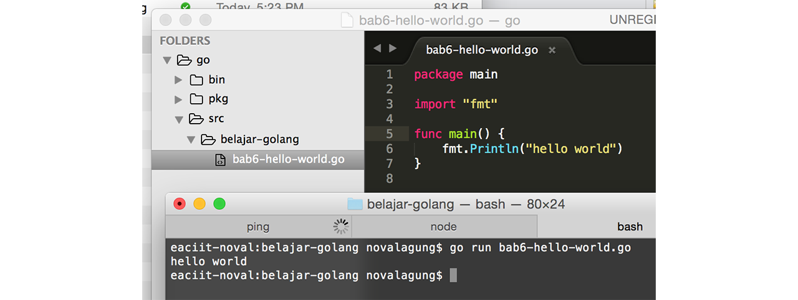

# Program Pertama: Hello World

Semua persiapan sudah selesai, saatnya mulai masuk pada sesi pembuatan program. Program pertama yang akan kita buat adalah aplikasi kecil untuk memunculkan tulisan **Hello World**.

Di bab ini akan dijelaskan secara bertahap dari awal. Mulai pembuatan project, pembuatan file program, sesi penulisan kode (coding), hingga eksekusi aplikasi.

## Load `GOPATH` Ke Sublime Text

Hal pertama yang perlu dilakukan, adalah me-load atau memunculkan folder `GOPATH` di editor Sublime. Dengan begitu proyek-proyek Golang akan lebih mudah di-maintain. Caranya:

 1. Buka Sublime
 2. Buka explorer/finder, lalu cari ke folder yang merupakan `GOPATH`
 3. Klik-drag folder tersebut (kebetulan lokasi folder `GOPATH` saya bernama `go`), tarik ke Sublime
 4. Seluruh subfolder `GOPATH` akan terbuka di Sublime


> Nama variabel di sistem operasi non-Windows diawali dengan tanda dollar `$`, sebagai contoh `$GOPATH`. Sedangkan di Windows, nama variabel diapit karakter persen `%`, contohnya seperti `%GOPATH%`.

## Menyiapkan Folder Project

Selanjutnya, buat project folder baru dalam `$GOPATH/src`, dengan nama folder bebas (boleh menggunakan nama `belajar-golang` atau lainnya). Agar lebih praktis, buat folder tersebut lewat Sublime. Berikut adalah caranya.

 1. Klik kanan di folder `src`
 2. Klik **New Folder**, di bagian bawah akan muncul inputan kecil **Folder Name**
 3. Ketikkan nama folder, **belajar-golang**, lalu enter



## Menyiapkan File Program

File program disini maksudnya adalah file yang berisikan kode program Golang, yang berekstensi `.go`.

Di dalam project yang telah dibuat (`$GOPATH/src/belajar-golang/`), siapkan sebuah file dengan nama bebas, yang jelas harus ber-ekstensi `.go` (Pada contoh ini saya menggunakan nama file `bab6-hello-world.go`).

Pembuatan file program juga akan dilakukan lewat Sublime. Caranya silakan ikut petunjuk berikut.

 1. Klik kanan di folder `belajar-golang`
 2. Klik **New File**, maka akan muncul tab baru di bagian kanan
 3. Ketikkan di konten: `bab6-hello-world.go`
 4. Lalu tekan **ctrl+s** (**cmd+s** untuk M\*c OSX), kemudian enter
 5. File akan terbuat


## Program Pertama: Hello Word

Setelah project folder dan file program sudah siap, saatnya untuk mulai masuk ke sesi penulisan program atau **coding**.

Dibawah ini merupakan contoh kode program sederhana untuk memunculkan text atau tulisan **"hello world"** ke layar output (command line).

Silakan salin kode berikut ke file program yang telah dibuat. Sebisa mungkin jangan copy paste. Biasakan untuk menulis dari awal, agar cepat terbiasa dan familiar dengan Golang.

```go
package main

import "fmt"

func main() {
    fmt.Println("hello world")
}
```

Setelah kode disalin, buka terminal (atau CMD bagi pengguna Wind\*ws), lalu masuk ke direktori proyek menggunakan perintah `cd`.

 - Windows

    ```
    $ cd %GOPATH%\src\belajar-golang
    ```

 - Non-Windows

    ```
    $ cd $GOPATH/src/belajar-golang
    ```


Jalankan program dengan perintah `go run`.

```
$ go run bab6-hello-world.go
```

Hasilnya, muncul tulisan **hello world** di layar console.



Selamat! Anda telah berhasil membuat program menggunakan Golang!

---

Meski kode program di atas sangat sederhana, mungkin akan muncul beberapa pertanyaan di benak. Di bawah ini merupakan detail penjelasan mengenai kode di atas.

## Penggunaan Keyword `package`

Setiap file program harus memiliki package. Setiap project harus ada satu file dengan package bernama `main`. File yang ber-package `main`, akan di eksekusi pertama kali ketika program di jalankan.

Cara penentuan package adalah menggunakan keyword `package`, berikut adalah contoh penggunaannya.

```go
package <nama-package>
package main
```

## Penggunaan Keyword `import`

Keyword `import` digunakan untuk meng-include atau memasukan package lain kedalam file program, agar isi package yang di-include bisa dimanfaatkan.

Package `fmt` merupakan salah satu package yang disediakan oleh Golang, berisikan banyak fungsi untuk keperluan **I/O** yang berhubungan dengan text.

Berikut adalah skema penulisan keyword `import` beserta contohnya.

```go
import "<nama-package>"
import "fmt"
```

## Penggunaan Fungsi `main()`

Dalam sebuah proyek harus ada file program yang berisikan sebuah fungsi bernama `main()`. Fungsi tersebut harus berada dalam package yang juga bernama `main`. Fungsi `main()` adalah yang dipanggil pertama kali pada saat eksekusi program.

Berikut merupakan contoh penulisannya.

```go
func main() {

}
```

## Penggunaan Fungsi `fmt.Println()`

Fungsi `fmt.Println()` digunakan untuk memunculkan text ke layar (pada konteks ini, terminal atau CMD). Di program pertama yang telah kita buat, fungsi ini memunculkan tulisan **Hello World**.

Berikut adalah skema penulisan fungsi `fmt.Println()` beserta contohnya.

```go
fmt.Println("<isi-pesan>")
fmt.Println("hello world")
```

Fungsi `fmt.Println()` berada dalam package `fmt`, maka untuk menggunakannya perlu package tersebut untuk di-import terlebih dahulu.

Fungsi `fmt.Println()` dapat menampung parameter yang tidak terbatas jumlahnya. Semua data parameter akan dimunculkan dengan pemisah tanda spasi. Contohnya bisa dilihat di kode berikut.

```go
fmt.Println("hello", "world!", "how", "are", "you")
```

Outputnya: **hello world! how are you**.
