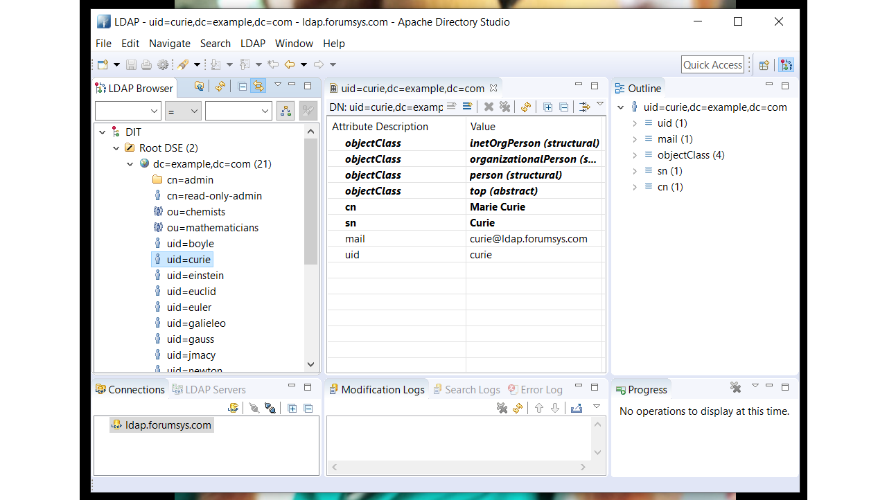
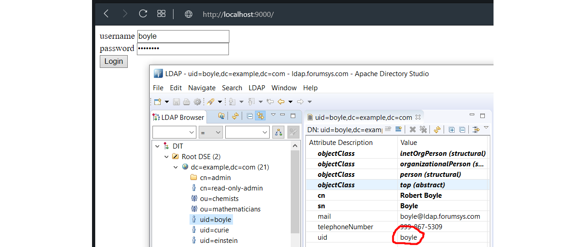

# C.33. LDAP Authentication

Pada bab ini kita belajar mengenai otentikasi user ke *Directory Service* lewat protokol LDAP. Pembelajaran akan kita awali dengan membahas sedikit mengenai definisi dari LDAP dan beberapa istilah relevan lainnya.

## C.33.1. Definisi

### LDAP

LDAP (Lightweight Directory Access Protocol) adalah protokol yang digunakan untuk mengakses **Directory Services** dalam sebuah komunikasi client-server.

### Directory Services

Directory Services adalah sebuah sistem yang menyimpan, mengelola, dan menyediakan akses informasi untuk menghubungkan sumber daya network (atau network resources). Network resources yang dimaksud contohnya:

- Email
- Perangkat periferal
- Komputer
- Folder/Files
- Printers
- Nomor telephone
- ...

Cakupan network resources mulai dari hardware seperti komputer (atau lebih tinggi lagi) hingga aspek yang relatif kecil seperti file.

Dengan terhubungnya resources tersebut, akan mudah bagi kita untuk mengelola banyak hal yang berhubungan dengan network. Contoh misalnya membuat aplikasi yang bisa login menggunakan credentials email kantor, atau banyak lainnya.

<div id="ads">&nbsp;</div>

Selain itu, juga LDAP sering dimanfaatkan dalam implementasi SSO (Single sign-on).

### Bind Operation

Operasi bind digunakan untuk otentikasi client ke directory server, dan juga untuk mengubah state otorisasi client tersebut. Operasi bind dilakukan dengan mengirim informasi bind dn dan password.

### Directory Server untuk testing

Karena komunikasi adalah client-server maka kita perlu menggunakan salah satu directory server untuk keperluan testing. Beruntung-nya [Forum Systems](www.forumsys.com) berbaik hati menyediakan directory server yg bisa diakses secara gratis oleh public, dan di bab ini akan kita menggunakannya. 

Berikut adalah informasi credentials directory server tersebut:

```
Server: ldap.forumsys.com  
Port: 389
Bind DN: cn=read-only-admin,dc=example,dc=com
Bind Password: password
```

Terdapat beberapa user data di sana, kesemuanya memiliki password yang sama, yaitu: `password`.

Lebih detailnya silakan cek di http://www.forumsys.com/tutorials/integration-how-to/ldap/online-ldap-test-server/

## C.33.2. LDAP Browser & Directory Client

Silakan gunakan LDAP browser yang disukai, atau bisa gunakan [Apache Directory Studio](https://directory.apache.org/studio/).

Buat koneksi baru menggunakan credentials di atas. Lakukan hingga berhasil memunculkan list user data seperti gambar berikut.



Bisa dilihat bahwa terdapat beberapa user data. Nantinya testing akan dilkakukan dengan login menggunakan salah satu user tersebut.

OK, sekarang mari kita masuk ke bagian tulis-menulis kode.

## C.33.3. Login Web App

Pertama kita buat terlebih dahulu aplikasi web sederhana, dengan dua buah rute dipersiapkan.

- Landing page, memunculkan form login
- Action login endpoint, untuk handle proses login

Buat file `main.go`, lalu siapkan html string untuk login form.

```go
package main

import "net/http"
import "fmt"
import "html/template"

// the port where web server will run
const webServerPort = 9000

// the login form html
const view = `<html>
    <head>
        <title>Template</title>
    </head>
    <body>
		<form method="post" action="/login">
			<div>
				<label>username</label>
				<input type="text" name="username" required/>
			</div>
			<div>
				<label>password</label>
				<input type="password" name="password" required/>
			</div>
			<button type="submit">Login</button>
		</form>
    </body>
</html>`
```

Lalu buat fungsi `main()`, siapkan route handler landing page, parse html string di atas.

```go
http.HandleFunc("/", func(w http.ResponseWriter, r *http.Request) {
    var tmpl = template.Must(template.New("main-template").Parse(view))
    if err := tmpl.Execute(w, nil); err != nil {
        http.Error(w, err.Error(), http.StatusInternalServerError)
    }
})
```

Kemudian siapkan route handler untuk action login.

```go
http.HandleFunc("/login", func(w http.ResponseWriter, r *http.Request) {
    r.ParseForm()

    username := r.PostFormValue("username")
    password := r.PostFormValue("password")

    // authenticate via ldap
    ok, data, err := AuthUsingLDAP(username, password)
    if !ok {
        http.Error(w, "invalid username/password", http.StatusUnauthorized)
        return
    }
    if err != nil {
        http.Error(w, err.Error(), http.StatusUnauthorized)
        return
    }

    // greet user on success
    message := fmt.Sprintf("welcome %s", data.FullName)
    w.Write([]byte(message))
})
```

Pada kode di atas proses otentikasi di handle secara implisit oleh fungsi `AuthUsingLDAP()`, yang akan kita buat pastinya. Ketika user sukses melakukan login maka pesan `selamat datang` akan ditampilkan disertai dengan nama lengkap user (data nama didapat nantinya dari user data di directory service).

OK, dua handler sudah siap, tambahkan kode untuk start webserver.

```go
portString := fmt.Sprintf(":%d", webServerPort)
fmt.Println("server started at", portString)
http.ListenAndServe(portString, nil)
```

## C.33.4. Handling the LDAP Authentication

Masuk ke bagian kode LDAP, buat file baru di folder yang sama, `ldap.go`. Import library ldap dan siapkan beberapa konstanta.

```go
package main

import (
	"fmt"
	"github.com/go-ldap/ldap"
)

const (
	ldapServer   = "ldap.forumsys.com"
	ldapPort     = 389
	ldapBindDN   = "cn=read-only-admin,dc=example,dc=com"
	ldapPassword = "password"
	ldapSearchDN = "dc=example,dc=com"
)
```

3rd party lib [https://github.com/go-ldap/ldap](github.com/go-ldap/ldap) kita gunakan untuk melakukan operasi client-server dengan directory server. Silakan `go get` terlebih dahulu jika belum.

Beberapa konstanta di atas isinya sesuai dengan credentials directory server test yang di atas sudah kita bahas. Diluar itu ada satu tambahan konstanta, yaitu `ldapSearchDN`, nantinya kita perlukan dalam melakukan operasi search.

Selanjutnya, siapkan struct untuk menampung user data yang dikembalikan oleh directory server.

```go
type UserLDAPData struct {
	ID       string
	Email    string
	Name     string
	FullName string
}
```

Buat fungsi `AuthUsingLDAP()`, lalu inisialisasi koneksi ldap. Fungsi ini menerima dua parameter, username dan password, yang keduanya diinputkan oleh user nantinya lewat browser.

```go
func AuthUsingLDAP(username, password string) (bool, *UserLDAPData, error) {
	l, err := ldap.Dial("tcp", fmt.Sprintf("%s:%d", ldapServer, ldapPort))
	if err != nil {
		return false, nil, err
	}
    defer l.Close()

    // ...
}
```

Fungsi `ldap.Dial()` digunakan untuk melakukan handshake dengan directory server.

Setelah itu lakukan bind operation menggunakan Bind DN dan password sesuai konstanta yang sudah dipersiapkan. Gunakan method `.Bind()` milik objek hasil dial ldap untuk bind.

```go
err = l.Bind(ldapBindDN, ldapPassword)
if err != nil {
    return false, nil, err
}
```

Setelah bind sukses, lakukan operasi search. Siapkan terlebih dahulu objek search request. Klausa search yang digunakan adalah `uid` atau username dengan base dn adalah `ldapSearchDN`.

```go
searchRequest := ldap.NewSearchRequest(
    ldapSearchDN,
    ldap.ScopeWholeSubtree,
    ldap.NeverDerefAliases,
    0,
    0,
    false,
    fmt.Sprintf("(&(objectClass=organizationalPerson)(uid=%s))", username),
    []string{"dn", "cn", "sn", "mail"},
    nil,
)
```

Klausa dituliskan dalam bentuk **LDAP Filter Syntax**. Bisa dilihat di atas merupakan contoh filter uid/username. Lebih jelasnya mengenai sintaks ini silakan merujuk ke http://www.ldapexplorer.com/en/manual/109010000-ldap-filter-syntax.htm

Parameter setelah filter adalah informasi atributtes yang ingin kita dapat dari hasil search request.

Berikutnya, trigger object search request tersebut lewat method `.Search()` dari objek ldap. Cek data yang dikembalikan (accessible via `.Entries` property), jika tidak ada data maka kita asumsikan search gagal.

```go
sr, err := l.Search(searchRequest)
if err != nil {
    return false, nil, err
}

if len(sr.Entries) == 0 {
    return false, nil, fmt.Errorf("User not found")
}
entry := sr.Entries[0]
```

Jika semuanya berjalan lancar, maka kita akan dapat setidaknya 1 user data. Lakukan bind operation menggunakan DN milik user tersebut dengan password adalah yang diinputkan user. Ini diperlukan untuk mem-validasi apakah password yang di-inputkan user sudah benar atau tidak.

```go
err = l.Bind(entry.DN, password)
if err != nil {
    return false, nil, err
}
```

Jika semua masih berjalan lancar, berarti proses otentikasi bisa dipastikan berhasil. Tapi ada satu hal lagi yang perlu dilakukan, yaitu serialisasi data attributes kembalian dari server untuk fit ke object `UserLDAPData` yang sudah disiapkan.

```go
data := new(UserLDAPData)
data.ID = username

for _, attr := range entry.Attributes {
    switch attr.Name {
    case "sn":
        data.Name = attr.Values[0]
    case "mail":
        data.Email = attr.Values[0]
    case "cn":
        data.FullName = attr.Values[0]
    }
}

return true, data, nil
```

## C.33.5. Testing

Ok, mari kita test. Jalankan program, lalu akses http://localhost:9000/; Lakukan login menggunakan salah satu user yang ada (silakan cek di LDAP browser anda). Di sini saya pilih menggunakan user `boyle`, password-nya `password` (semua user ber-kata-sandi sama).



Login berhasil, dibuktikan dengan munculnya fullname **Robert Boyle**. Coba juga gunakan password yang salah agar lebih meyakinkan.


## C.33.6. LDAP TLS

Untuk koneksi LDAP yang TLS-enabled, maka cukup panggil method `.StartTLS()` milik objek ldap dial, dan isi parameternya dengan tls config. Pemanggilan fungsi ini harus tepat setelah proses dial ke directory server.

```go
l, err := ldap.Dial("tcp", fmt.Sprintf("%s:%d", ldapServer, ldapPort))
if err != nil {
    return false, nil, err
}
defer l.Close()

// reconnect with TLS
err = l.StartTLS(tlsConfig)
if err != nil {
    return false, nil, err
}
```

---

 - [go-ldap/ldap](https://github.com/go-ldap/ldap), by go-ldap team, MIT License

---

<div class="source-code-link">
    <div class="source-code-link-message">Source code praktek pada bab ini tersedia di Github</div>
    <a href="https://github.com/novalagung/dasarpemrogramangolang/tree/master/chapter-C.33-ldap-authentication">https://github.com/novalagung/dasarpemrogramangolang/.../chapter-C.33...</a>
</div>
