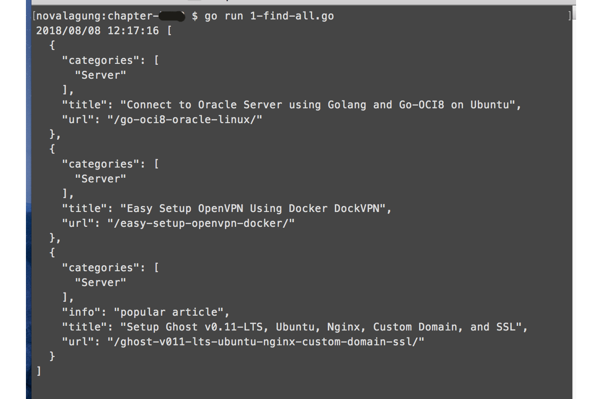
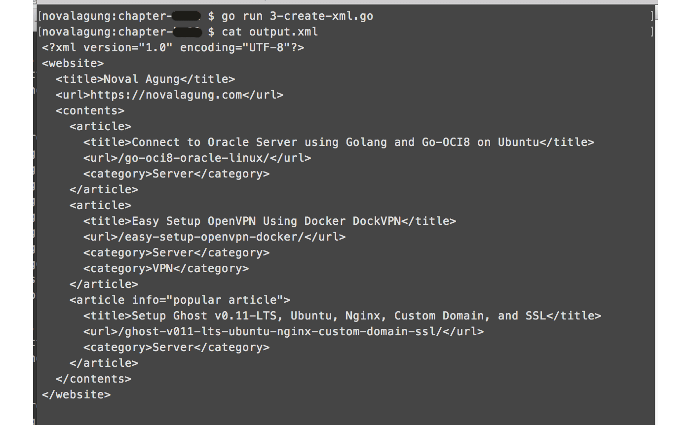

# C.23. Parse & Generate XML (etree)

Pada chapter ini kita akan belajar cara parsing file xml, dan cara membuat xml baru. Library yang digunakan adalah [etree](https://github.com/beevik/etree), silakan `go get` terlebih dahulu.

```go
go get -u github.com/beevik/etree
```

## C.23.1. Membaca dan Parsing File XML

Mari langsung kita praktekan, siapkan folder project baru. Buat satu buah file `data.xml`, isinya sebagai berikut.

```xml
<?xml version="1.0" encoding="UTF-8"?>
<website>
    <title>Noval Agung</title>
    <url>https://novalagung.com</url>
    <contents>
        <article>
            <category>Server</category>
            <title>Connect to Oracle Server using Golang and Go-OCI8 on Ubuntu</title>
            <url>/go-oci8-oracle-linux/</url>
        </article>
        <article>
            <category>Server</category>
            <title>Easy Setup OpenVPN Using Docker DockVPN</title>
            <url>/easy-setup-openvpn-docker/</url>
        </article>
        <article info="popular article">
            <category>Server</category>
            <title>Setup Ghost v0.11-LTS, Ubuntu, Nginx, Custom Domain, and SSL</title>
            <url>/ghost-v011-lts-ubuntu-nginx-custom-domain-ssl/</url>
        </article>
    </contents>
</website>
```

Silakan perhatikan xml di atas, akan kita ambil semua element `article` beserta isinya, untuk kemudian ditampung dalam slice.

Buat file main, di dalamnya, buat objek dokumen bertipe `etree.Document` lewat fungsi `etree.NewDocument()`. Dari objek tersebut, baca file xml yang sudah dibuat, gunakan method `.ReadFromFile()` untuk melakukan proses baca file.

```go
package main

import (
    "encoding/json"
    "github.com/beevik/etree"
    "log"
)

type M map[string]interface{}

func main() {
    doc := etree.NewDocument()
    if err := doc.ReadFromFile("./data.xml"); err != nil {
        log.Fatal(err.Error())
    }

    // ...
}
```

Dari objek `doc`, ambil root element `<website/>`, lalu akses semua element `<article/>` kemudian lakukan perulangan. Di dalam tiap perulangan, ambil informasi `title`, `url`, dan `category`, tampung sebagai element slice `rows`.

```go
root := doc.SelectElement("website")
rows := make([]M, 0)

for _, article := range root.FindElements("//article") {
    row := make(M)
    row["title"] = article.SelectElement("title").Text()
    row["url"] = article.SelectElement("url").Text()

    categories := make([]string, 0)
    for _, category := range article.SelectElements("category") {
        categories = append(categories, category.Text())
    }
    row["categories"] = categories

    if info := article.SelectAttr("info"); info != nil {
        row["info"] = info.Value
    }

    rows = append(rows, row)
}
```

Objek element menyediakan beberapa method untuk keperluan seleksi dan pencarian element. Empat di antaranya sebagai berikut.

 - Method `.SelectElement()`, untuk mengambil satu buah child element sesuai selector.
 - Method `.SelectElements()`, sama seperti `.SelectElement()`, perbedannya yang dikembalikan adalah semua child elements (sesuai selector).
 - Method `.FindElement()`, untuk mencari elements dalam current element, bisa berupa child, grand child, atau level yang lebih dalam, sesuai selector. Yang dikembalikan satu buah element saja.
 - Method `.FindElements()`, sama seperti `.FindElement()`, perbedannya yang dikembalikan adalah semua elements (sesuai selector).

Pada kode di atas, hasil dari statement `root.FindElements("//article")` di looping. Statement tersebut mengembalikan banyak element sesuai selector pencarian. Arti selector `//article` sendiri adalah melakukan pencarian element dengan nama `article` secara rekursif.

Di tiap perulangan, child element `title` dan `url` diambil. Gunakan method `.Text()` untuk mengambil isi element.

Sedangkan pada element `<category/>` pencarian child elements dilakukan menggunakan method `.SelectElements()`, karena beberapa artikel memiliki lebih dari satu category.

Untuk mengakses value dari atribut, gunakan method `.SelectAttr()`.

Setelah perulangan selesai, data artikel ada dalam objek `rows`. Tampilkan isinya sebagai JSON string.

```go
bts, err := json.MarshalIndent(rows, "", "  ")
if err != nil {
    log.Fatal(err)
}

log.Println(string(bts))
```

Jalankan aplikasi, lihat hasilnya.



## C.23.2. XML Query

XQuery atau XML Query adalah bahasa query untuk pengolahan XML. Spesifikasinya bisa dilihat di https://www.w3.org/TR/xquery-31.

Pada pembahasan di atas kita menggunakan query `//article` untuk melakukan pencarian semua element artikel secara rekursif. 

Berikut adalah contoh lain implementasi xquery yang lebih kompleks.

```go
popularArticleText := root.FindElement(`//article[@info='popular article']/title`)
if popularArticleText != nil {
    log.Println("Popular article", popularArticleText.Text())
}
```

Penjelasan mengenai xquery `//article[@info='popular article']/title` dipecah menjadi 3 tahap agar mudah untuk dipahami.

 1. Selector bagian `//article`, artinya dilakukan pencarian rekursif dengan kriteria: element bernama `article`.
 2. Selector bagian `[@info='popular article']`, artinya dilakukan pencarian dengan kriteria: element memiliki atribut `info` yang berisi `popular article`.
 3. Selector bagian `/title`, artinya dilakukan pencarian child element dengan kriteria: element bernama `title`.

Jika 3 penjelasan bagian di atas digabungkan, maka kurang lebih arti dari `//article[@info='popular article']/title` adalah, dilakukan pencarian secara rekursif dengan kriteria adalah: element bernama `article` dan harus memiliki atribut `info` yang berisi `popular article`, setelah diketemukan, dicari child element-nya menggunakan kriteria: element bernama `title`.

Berikut adalah hasil dari query di atas.


Silakan coba explore sendiri mengenai xquery untuk contoh lainnya.

## C.23.3. Membuat XML dari Golang

Di atas kita telah mempelajari cara baca XML; kali ini kita akan coba buat file XML menggunakan etree. Informasi yang akan ditulis ke file xml datanya bersumber dari JSON string (yang nantinya di-decode terlebih dahulu ke bentuk objek sebelum digunakan).

Siapkan file baru, buat struct `Document`. Nantinya sebuah objek dicetak lewat struk ini, tugasnya sendiri adalah menampung data hasil proses decoding json.

```go
package main

import (
    "encoding/json"
    "github.com/beevik/etree"
    "log"
)

type Document struct {
    Title   string
    URL     string
    Content struct {
        Articles []struct {
            Title      string
            URL        string
            Categories []string
            Info       string
        }
    }
}

func main () {
    // code here
}
```

Siapkan JSON string.

```go
const jsonString = `{
    "Title": "Noval Agung",
    "URL": "https://novalagung.com",
    "Content": {
        "Articles": [{
            "Categories": [ "Server" ],
            "Title": "Connect to Oracle Server using Golang and Go-OCI8 on Ubuntu",
            "URL": "/go-oci8-oracle-linux/"
        }, {
            "Categories": [ "Server", "VPN" ],
            "Title": "Easy Setup OpenVPN Using Docker DockVPN",
            "URL": "/easy-setup-openvpn-docker/"
        }, {
            "Categories": [ "Server" ],
            "Info": "popular article",
            "Title": "Setup Ghost v0.11-LTS, Ubuntu, Nginx, Custom Domain, and SSL",
            "URL": "/ghost-v011-lts-ubuntu-nginx-custom-domain-ssl/"
        }]
    }
}`
```

Decode JSON string di atas ke objek cetakan `Document`.

```go
data := Document{}
err := json.Unmarshal([]byte(jsonString), &data)
if err != nil {
    log.Fatal(err.Error())
}
```

Selanjutnya buat objek etree baru, siapkan root element `website`. Di dalamnya buat 2 child elements: `title` dan `url`, nilai masing-masing didapat dari objek `data`.

```go
doc := etree.NewDocument()
doc.CreateProcInst("xml", `version="1.0" encoding="UTF-8"`)

website := doc.CreateElement("website")

website.CreateElement("title").SetText(data.Title)
website.CreateElement("url").SetText(data.URL)
```

Method `.CreateElement()` digunakan untuk membuat child element baru. Pemanggilannya disertai dengan satu parameter, yang merupakan representasi dari nama element yang ingin dibuat.

Method `.SetText()` digunakan untuk menge-set nilai element.

Siapkan satu element lagi di bawah root, namanya `contents`. Loop objek slice artikel, dan di tiap perulangannya, buat element dengan nama `article`, sisipkan sebagai child `contents`.

```go
content := website.CreateElement("contents")

for _, each := range data.Content.Articles {
    article := content.CreateElement("article")
    article.CreateElement("title").SetText(each.Title)
    article.CreateElement("url").SetText(each.URL)

    for _, category := range each.Categories {
        article.CreateElement("category").SetText(category)
    }

    if each.Info != "" {
        article.CreateAttr("info", each.Info)
    }
}
```

Khusus untuk objek artikel yang property `.Info`-nya tidak kosong, buat atribut dengan nama `info` pada element `article` yang bersangkutan, simpan nilai property sebagai nilai atribut tersebut.

Terakhir simpan objek dokumen etree sebagai file.

```go
doc.Indent(2)

err = doc.WriteToFile("output.xml")
if err != nil {
    log.Println(err.Error())
}
```

Method `.Indent()` di atas digunakan untuk menentukan indentasi element dalam file.

Jalankan aplikasi, lihat hasilnya.



---

 - [etree](https://github.com/beevik/etree), by Brett Vickers, BSD-2-Clause license

---

<div class="source-code-link">
    <div class="source-code-link-message">Source code praktek chapter ini tersedia di Github</div>
    <a href="https://github.com/novalagung/dasarpemrogramangolang-example/tree/master/chapter-C.23-xml-parser">https://github.com/novalagung/dasarpemrogramangolang-example/.../chapter-C.23...</a>
</div>

---

<iframe src="partial/ebooks.html" width="100%" height="360px" frameborder="0" scrolling="no"></iframe>
